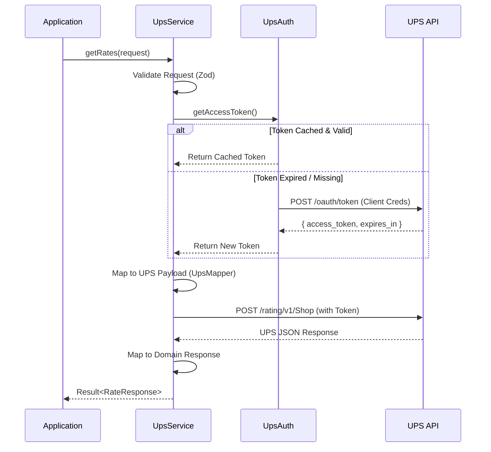

# Carrier Integration Service - UPS Implementation

This project implements a backend service for integrating with the UPS Rating API. It is designed to be a robust, extensible, and type-safe module that allows an application to request shipping rates from UPS.

## Architecture & Design Decisions

The project follows a Clean Architecture approach, separating domain logic from infrastructure details.

### 1. Domain Layer (`src/domain/`)

**What it is:**
This layer defines the core business objects and rules that are independent of any specific carrier or external system.

**Key Components:**

- **`CarrierService` Interface**: Defines the contract that all carrier implementations (UPS, FedEx, etc.) must follow. This ensures that the consuming application can switch carriers without changing its own logic.
- **`RateRequest` / `RateResponse`**: Standardized internal types for shipping requests and quotes. We purposefully do not use UPS-specific types here to keep our domain model clean.
- **Validation Schemas (`validation.ts`)**: We use **Zod** to define runtime validation rules. This ensures that any data entering our system is checked for correctness (e.g., valid country codes, positive weights) before we even attempt to contact a carrier.

### 2. Infrastructure Layer (`src/services/ups/`)

**What it is:**
This layer contains the specific implementation details for communicating with the UPS API.

**Key Components:**

- **`UpsService`**: The main entry point. It orchestrates the flow: Validate Request -> Get Auth Token -> Map to UPS Format -> Call API -> Map Response -> Return Result.
- **`UpsAuth`**: unique class dedicated to handling OAuth 2.0.
  - **Why:** UPS uses a short-lived access token mechanism (Client Credentials Flow).
  - **How:** This class fetches a token using the Client ID/Secret. Crucially, it **caches** the token in memory and checks its expiration time (`expires_in`) before every request. If the token is valid, it reuses it instantly. If expired, it transparently fetches a new one. This minimizes latency and API calls.
- **`UpsMapper`**: A static helper class that translates data.
  - **Why:** UPS API variable names are often verbose or non-standard (e.g., `StateProvinceCode`).
  - **How:** This class purely converts our internal `RateRequest` into the `UPSRateRequest` JSON structure, and vice versa. It isolates the "messy" external API details from our clean codebase.
- **DTOs (`dto.ts`)**: TypeScript interfaces that exactly match the JSON structure expected by UPS. These act as a contract for the network layer.

### Sequence Diagram



### 3. Error Handling (`src/errors/` & `src/utils/`)

**What it is:**
A structured approach to managing failures.

**Design:**

- **`Result` Pattern**: Instead of throwing exceptions everywhere (which can be easily missed), the service returns a `Result<T>` type which is either `{ success: true, data: T }` or `{ success: false, error: ... }`. This forces the consumer to handle both success and failure cases explicitly.
- **Typed Errors**: We defined specific error classes:
  - `ValidationError`: Input was bad (400).
  - `AuthError`: Failed to get a token from UPS (401).
  - `CarrierError`: UPS returned an error or was unreachable (502).

## Testing Strategy

Since we do not have a live UPS production account for this assessment, reliance on **Integration Testing** with mocking is critical.

**Tooling:**
We use **Bun's built-in test runner** (`bun test`) and **Vitest** compatible APIs.

**Approach (`test/integration/ups.test.ts`):**
The tests treat the `UpsService` as a black box but replace the network layer (`global.fetch`) with a mock.

1.  **Mocking**: We intercept outgoing HTTP requests.
2.  **Scenarios**:
    - **Success Path**: We simulate a successful Token response followed by a successful Rate response. We verify that the service parses the complex UPS JSON correctly.
    - **Auth Reuse**: We verify that subsequent calls do _not_ trigger a new token fetch if the cached token is still valid.
    - **Error Handling**: We simulate network failures and 400/500 status codes from UPS to ensure our code translates them into the correct internal error types.

## Setup & Running

This project is compatible with **Node.js** (v18+) and **Bun**.

### Installation

Choose your preferred package manager:

```bash
# npm
npm install

# yarn
yarn install

# pnpm
pnpm install

# bun
bun install
```

### Configuration

Copy the example environment file:

```bash
cp .env.example .env
```

Fill in the `UPS_CLIENT_ID` and `UPS_CLIENT_SECRET`. (For running tests, these can be dummy values).

### Running Tests

We use **Vitest** conventions. You can run tests using:

```bash
# npm
npm test

# yarn
yarn test

# pnpm
pnpm test

# bun
bun test
```

## Future Improvements

Given more time, we would implement:

1.  **Resilience**: Add retry logic (exponential backoff) for network timeouts.
2.  **Redis Caching**: Move the in-memory token cache to Redis so that multiple server instances can share the same UPS token.
3.  **Metrics**: Add instrumentation (OpenTelemetry) to track API latency and error rates.
